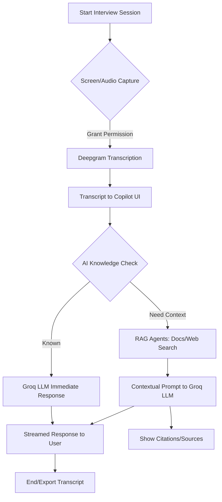

# AI Interview Copilot

---

## Overview

*AI Interview Copilot* is a next-generation, real-time AI-powered assistant designed to streamline and enhance the technical interview process. Built for interviewers, hiring managers, and technical recruiters, this tool leverages state-of-the-art speech-to-text, large language models (LLMs), and retrieval-augmented generation (RAG) to provide instant, context-aware support during live interviews. The Copilot transcribes interviewer audio, analyzes candidate responses, and delivers intelligent, actionable suggestions, summaries, and follow-up questions—all in a clean, professional, and minimal UI.

---

## Features

### 🎙 Real-Time Audio Transcription
- *Deepgram Integration:* Captures and transcribes interviewer/system audio in real time using advanced speech recognition.
- *Screen Sharing Preview:* Visual feedback for active screen/audio capture, with robust error handling and fallback logic.
- *Speaker Labeling:* Only "Interviewer" audio is transcribed and displayed, ensuring clarity and focus.

### 🤖 AI Reasoning & Response
- *Groq LLM Integration:* Utilizes Groq's ultra-fast, high-accuracy LLMs (Llama 3) for instant reasoning, explanations, and follow-up questions.
- *Intelligent Routing:* The system first checks if the LLM can answer from its own knowledge. If not, it automatically triggers RAG agents to fetch relevant context from documents, web, or company knowledge bases.
- *Progressive Enhancement:* Users receive immediate AI responses, with additional sources and citations appended as soon as RAG completes, minimizing wait time.

### 📚 Retrieval-Augmented Generation (RAG)
- *Contextual Search:* When the LLM needs more information, RAG agents search internal documents, PDFs, and web sources to provide accurate, context-rich answers.
- *Citations & Sources:* All RAG-based responses include clear, structured citations for transparency and auditability.

### 📝 Minimal, Professional UI
- *Clean Design:* No gradients, cards, or unnecessary UI elements—just a focused, distraction-free workspace.
- *Chat-Style Transcription:* All interviewer speech is displayed in a chat interface, with clear timestamps and speaker labels.
- *Screen Sharing:* Prominent, resizable preview for screen/audio capture, with live status indicators.

### 🛡 Robustness & Security
- *Error Handling:* Graceful fallbacks for audio/video issues, API errors, and permission denials.
- *Environment Variables:* All API keys and sensitive configs are managed via .env files.
- *No Candidate Audio:* Only interviewer/system audio is captured, ensuring privacy and compliance.

---

## 🚀 BlitzQ - Production SaaS Built on This Prototype

Building on this open-source prototype, I created *BlitzQ* - a comprehensive SaaS platform that takes interview preparation to the next level.

### *Ace Every Interview with BlitzQ*
Your intelligent AI-powered interview copilot that provides real-time answers, helps you practice, and boosts your confidence. Ace every interview and land your dream job.

  
   
  <em>BlitzQ - Production-ready AI interview assistance platform</em>

### *Real Interview Experience*

  
   
  <em>BlitzQ in action during a live technical interview - real-time AI suggestions and contextual help</em>

### *Practice and Examples*

  
   
  <em>BlitzQ's practice mode with curated interview questions and AI-generated example responses</em>

*BlitzQ Features:*
- 🎯 *Real-time AI Assistance*: Get instant, contextual answers during live interviews
- 📚 *Smart Knowledge Base*: Access curated technical questions and best practices
- 🎓 *Practice Mode*: Simulate interviews with AI feedback and improvement suggestions
- 📊 *Performance Analytics*: Track your progress and identify areas for improvement
- 🔐 *Enterprise Security*: SOC2 compliant with end-to-end encryption
- 🌍 *Multi-language Support*: Available in 15+ languages for global candidates

---

## System Flowchart

---

## Architecture

- *Frontend:* Next.js, React, Tailwind CSS
- *Audio/Video:* Web APIs for screen/audio capture, Deepgram SDK for transcription
- *AI/LLM:* Groq SDK for Llama 3 models, with intelligent routing between LLM and RAG
- *RAG:* Modular agents for document, PDF, and web search (Pinecone, Tavily, etc.)
- *Backend:* API routes for streaming LLM responses, RAG orchestration, and context management

---

### 2. Install Dependencies
bash
npm install
# or
yarn install

### 3. Configure Environment Variables
Copy .env.example to .env and fill in your API keys:
bash
cp .env.example .env

- GROQ_API_KEY (Groq LLM)
- NEXT_PUBLIC_DEEPGRAM_API_KEY (Deepgram)
- PINECONE_API_KEY, TAVILY_API_KEY, etc. (for RAG)

### 4. Run the App
bash
npm run dev
# or
yarn dev

Visit [http://localhost:3000](http://localhost:3000) to use the Copilot.

---

## Usage

1. *Start Screen Sharing:* Click "Connect" to begin capturing interviewer audio and screen.
2. *Live Transcription:* The Copilot will transcribe all interviewer speech in real time.
3. *Ask Questions:* Type or speak interview questions; the Copilot will provide instant AI-powered suggestions and follow-ups.
4. *Review Sources:* If the AI needs more context, sources and citations will appear after the initial response.
5. *Export/Save:* Download or copy chat transcripts for record-keeping or feedback.

---

## Advanced Capabilities

- *Intelligent LLM Routing:* The Copilot uses a knowledge-check prompt to decide if the LLM can answer directly. If not, it triggers RAG for deeper context.
- *Streaming Responses:* All AI and RAG responses are streamed for minimal latency.
- *Customizable Models:* Easily switch between Groq, Gemini, or OpenAI by updating environment variables and config files.
- *Extensible RAG Agents:* Add new document or web search agents by extending the RAG orchestrator.

---

## File Structure

- /app - Next.js app, API routes, and main pages
- /components - UI components (recorder, chat, PDF manager, etc.)
- /lib - Core logic (transcription manager, LLM/RAG clients, utils)
- /public - Static assets
- /scripts - Setup and utility scripts
- /docs - Technical and integration documentation

---

## Contributing

1. Fork the repo and create a feature branch.
2. Make your changes with clear, well-documented code.
3. Add/modify tests as needed.
4. Submit a pull request with a detailed description.

---

## Troubleshooting

- *Audio/Screen Not Captured:* Ensure browser permissions are granted for screen and audio.
- *API Errors:* Check your .env file for correct API keys and quotas.
- *Slow Responses:* RAG-based answers may take longer; LLM-only answers are near-instant.
- *UI Issues:* Clear browser cache or try a different browser.

---

## Acknowledgments

- [Deepgram](https://deepgram.com) for real-time transcription
- [Groq](https://groq.com) for ultra-fast LLMs
- [Pinecone](https://pinecone.io) and [Tavily](https://tavily.com) for RAG/search
- [Next.js](https://nextjs.org), [React](https://react.dev), and [Tailwind CSS](https://tailwindcss.com) for the frontend

You are an expert AI system architect, full-stack developer, and machine learning engineer.

Your task is to DESIGN and BUILD an end-to-end AI Interview Preparation Platform.

====================
PROJECT GOAL
====================
Create a web-based platform that helps users prepare for interviews by:
- Asking role-specific interview questions
- Evaluating text and spoken answers using ML
- Providing structured AI feedback
- Tracking user progress over time

The system must be production-ready, modular, scalable, and resume-worthy.

====================
CORE FEATURES
====================

1. USER INTERACTION
- User authentication (JWT-based)
- Role selection (Frontend, Backend, ML, Data Analyst, HR)
- Mock interview sessions
- Text-based and optional voice-based answers
- Timed interview experience

2. MACHINE LEARNING
A. Answer Evaluation (NLP)
- Convert user answers into embeddings using Sentence Transformers / BERT
- Compare with ideal answers using cosine similarity
- Score answers on:
  - Relevance
  - Clarity
  - Keyword coverage
  - Structure and length

Return output in JSON:
{
  "score": number (0–100),
  "strengths": [string],
  "weaknesses": [string],
  "suggestions": [string]
}

B. Question Recommendation
- Recommend next questions based on:
  - Role
  - Difficulty
  - User weak areas
- Use rule-based logic initially
- Keep architecture extensible for collaborative filtering

C. Optional Voice Analysis
- Speech-to-text (Whisper-style)
- Detect filler words
- Speaking speed
- Confidence score

D. Resume-Based Personalization (Advanced)
- Parse uploaded resume
- Extract skills and experience
- Generate tailored interview questions

====================
TECH STACK (MANDATORY)
====================
Frontend:
- React or Next.js
- Tailwind CSS
- Chart.js or Recharts

Backend:
- FastAPI
- RESTful APIs
- Background tasks for ML inference

Database:
- PostgreSQL (primary)
- Redis (optional caching)

ML Stack:
- Sentence Transformers
- NLP similarity scoring
- Optional Whisper integration

====================
API DESIGN
====================
Design clean APIs including:
- POST /auth/login
- POST /auth/register
- POST /start-interview
- POST /submit-answer
- GET /feedback/{answer_id}
- GET /progress/{user_id}
- POST /upload-resume

====================
DATABASE DESIGN
====================
Design normalized schemas for:
- Users
- Questions
- Answers
- Feedback
- Progress

Include SQL schema definitions.

====================
SYSTEM ARCHITECTURE
====================
Frontend → FastAPI Backend → ML Services → PostgreSQL
Ensure clean separation of concerns.

====================
DELIVERABLES
====================
You must generate:

1. High-level system architecture explanation
2. ER diagram (textual description)
3. Backend folder structure
4. Frontend folder structure
5. ML pipeline explanation
6. Sample API request/response JSON
7. Database schema (SQL)
8. Deployment strategy (AWS / Render)
9. Final-year project–ready explanation
10. Clear implementation roadmap

====================
CONSTRAINTS
====================
- Write clean, readable, modular code
- Explain decisions clearly
- Assume this is a FINAL YEAR ENGINEERING PROJECT
- Optimize for clarity, correctness, and real-world usability

Begin step-by-step.
Do not skip design reasoning.
Explain before implementing.

